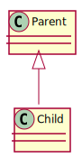

# 자바에서 상속이란?

다음의 코드는 `Parent` 클래스를 선언한다.

```java
// sec10/inheritance/Parent.java
package sec10.inheritance;

public class Parent {
    public Parent() {
        System.out.println("Parent Constructor.");
    }
    public void printName() {
        System.out.println("Parent printName().");
    }
}
```

그리고 이러한 `Parent` 를 상속받을 `Child` 클래스를 선언한다.

```java
// sec10/inheritance/Child.java
package sec10.inheritance;

public class Child extends Parent {
    public Child() {
        System.out.println("Child Constructor.");
    }
}
```

여기에서 `extends` 라는 키워드를 사용하는데, 이는 `Parent` 를 상속받는다는 뜻이다.
이렇게 상속받으면, 부모 클래스의 모든 변수 및 메서드를 받아 사용가능하다.

> 접근제어자가 `public`, `protected` 로 선언된, 메서드 및 변수만 상속 가능하다.<br/>
> `private-package` 혹은 `private` 같은 경우는 상속받지 못한다.

이는 중복을 없애며, 편하게 객체를 생성하는데 매우 유용하다.
다음은, 이러한 `Parent` 와 `Child` 간의 관계를 나타내는 `UML` 이다.


<div hidden>

```uml
@startuml parent_child_rel
Parent <|-- Child
@enduml
```
</div>

다음은 `Child` 의 인스턴스를 생성하여, `Parent` 클래스의 `printName` 이 호출되는지
확인해본다.

```java
// sec10/inheritance/InheritancePrint.java
package sec10.inheritance;

public class InheritancePrint {
    public static void main(String[] args) {
        Child child = new Child();
        child.printName();
    }
}

```

```sh

$ javac sec10/inheritance/*.java; java sec10/inheritance/InheritancePrint;

Parent Constructor.
Child Constructor.
Parent printName().

```

제대로 출력되는것을 볼수 있다.
상속에 대한 내용을 정리하면 다음과 같다.

- 부모 클래스에서 기본 생성자를 만들어 놓는 것 이외에는 상속을 위해서 아무런 작업을 할 필요는 없다.
- 자식 클래스는 클래스 선언시 extends 다음에 부모클래스 이름을 적어준다.
- 자식 클래스의 생성자가 호출되면, 자동으로 부모 클래스의 매개변수없는 생성자가 실행된다.
- 자식 클래스에서 부모 클래스에 있는 `public`, `protected` 로 선언된 모든 인스턴스 및 클래스 변수와 메소드를 사용할수 있다.

다음은 `ChildPrint` 라는 클래스를 만들어본다.

```java
package sec10.inheritance;

class ChildPrint extends Parent {
   public ChildPrint() {
        System.out.println("ChildPrint Constructor.");
   } 
    public void printAge() {
        System.out.println("printAge() - 18 month.");
    }
}
```

위는 `Parent` 의 메서드를 상속받으며, 추가적으로 `ChildPrint` 에서만 사용되는 `printAge` 메서드를 선언했다.
즉, 클래스를 잘 만들어 놓으면, 굳이 반복해서 작업이 필요없다는 말이된다.

단, 자바는 다중 상속이 안된다.
그러므로 하나의 클래스만 상속받을수 있다.

## 상속과 생성자

만약 부모 클래스에 매개변수가 있다면 어떻게 해야 할까?
이는 상속받는 자식 클래스에서, 부모 클래스가 받을 매개변수를 전달해주어야 한다.

이때 사용하는 메서드가 `super` 이다. 

```java
package sec10.inheritance;

public class ParentArg {
    public ParentArg(String name) {
        System.out.println("ParentArg(" + name + ") Constructor.");
    }

    public void printName() {
        System.out.println("printName() - ParentArg");
    }
}
```

그리고, 다음읜 `ChildArg` 에서 상속받는 코드이다.

```java
package sec10.inheritance;

public class ChildArg extends ParentArg {
    public ChildArg() {
        super("Child");
        System.out.println("Child Constructor.");
    }
}

```

이는 제대로 실행된다.
이렇게 상속받는 자식 클래스에서, 부모 클래스에 매개변수를 줄땐
`super` 를 사용해야 한다.

## 메서드 overriding

만약, 부모 클래스의 매서드를 자식 클래스에 맞게 재수정해야 한다면 어떻게 할까?
이때 사용하는거시 `overriding`(`덮어씌우기`) 이다.

```java
package sec10.inheritance;

public class ParentOverrding {
    public ParentOverrding() {
        System.out.println("ParentOverring Constructor.");
    }

    public void printName() {
        System.out.println("printName() - ParentOverrding");
    }
}

```

```java
package sec10.inheritance;

public class ChildOverrding extends ParentOverrding {
    public ChildOverrding() {
        System.out.println("ChildOverrding Constructor.");
    }

    public void printName() {
        System.out.println("printName() - ChildOverrding");
    }
}
```
`ChildOverrding` 을 호출한후, `printName` 을 호출하면, `ParentOverrding` 의 메서드가 아닌
`ChildOverrding` 의 `printName` 을 호출한다.

> 이를 동일한 `signature` 를 가진다고 표현한다.

`Overriding` 시 주의할 점이 있다.

### 접근범위

이는 `Access Modifier` 는 상속받은 `method` 를 더 좁은 타입으로
`overriding` 할수없다.

```java
// sec10/inheritance/ParentOverriding

package sec10.inheritance;

public class ParentOverriding {
  public ParentOverriding() {
    System.out.println("ParentOverriding Constructor.");
  }

  public void printName() {
    System.out.println("printName() - ParentOverrding");
  }
}

```

```java
// sec10/inheritance/ChildOverriding

package sec10.inheritance;

public class ChildOverriding extends ParentOverriding {
  public ChildOverriding() {
    System.out.println("ChildOverriding Constructor.");
  }

  protected void printName() {
    System.out.println("printName(String name) - ChildOverriding");
    // Java: Cannot reduce the visibility of the 
    // inherited method from ParentOverriding [67109273]
  }
}

```

"Java: `ParentOverriding` 에서 상속된 메서드의 가시성을 줄일수 없다." 라고 나온다.
이말은, `ParentOverriding.printName` 은 `public` 인데, 상속받는 클래스에서
`public` 보다 더 좁은 범위인 `protected` 를 사용해서 생긴 에러이다.

반대로 더 넓은 범위로 설정해보자.

```java
// sec10/inheritance/ParentOverriding

package sec10.inheritance;

public class ParentOverriding {
  public ParentOverriding() {
    System.out.println("ParentOverriding Constructor.");
  }

// protected 로 변경
  protected void printName() {
    System.out.println("printName() - ParentOverrding");
  }
}
```


```java
// sec10/inheritance/ChildOverriding

package sec10.inheritance;

public class ChildOverriding extends ParentOverriding {
  public ChildOverriding() {
    System.out.println("ChildOverriding Constructor.");
  }
    public void printName() {

    System.out.println("printName(String name) - ChildOverriding");
  }
}
```

에러 없이 잘 실행된다.

```sh
$ javac sec10/inheritance/InheritancePrintOverriding.java; java sec10/inheritance/InheritancePrintOverriding;

ParentOverriding Constructor.
ChildOverriding Constructor.
printName(String name) - ChildOverriding
```

> 접근범위는 다음과 같다<br/><br/>
`public` -> `protected` -> `package-private` -> `private`<br/><br/>

### 리턴타입

`Return type` 역시 `child class` 에서 마음대로 변경하지 못한다.

```java
package sec10.inheritance;

public class ParentOverriding {
  public ParentOverriding() {
    System.out.println("ParentOverriding Constructor.");
  }

  public void printName() {
    System.out.println("printName() - ParentOverrding");
  }
}
```

```java
package sec10.inheritance;

public class ChildOverriding extends ParentOverriding {
  public ChildOverriding() {
    System.out.println("ChildOverriding Constructor.");
  }

  public String printName() {
    // Java: The return type is incompatible with ParentOverriding.printName() [67109268]
    System.out.println("printName(String name) - ChildOverriding");
  }
}
```

"Java: 리턴타입이 `ParentOverriding.printName()`" 과 호환되지 않는다." 는 에러가 난다.
이는 리턴타입역시 부모 클래스와 같아야 함을 의미한다.

## 참조 자료형의 형변환

이는 상속관계에 다른 참조자료형의 형변환에 대한 이야기다.
다음을 보자

```java
package sec10.inheritance;

public class ParentCasting {
  public ParentCasting() {}
  public ParentCasting(String name) {}

  public void printName() {
    System.out.println("printName() - ParentCasting");
  }
}
```

```java
package sec10.inheritance;

public class ChildCasting extends ParentCasting {
  public ChildCasting() {}
  public ChildCasting(String name) {}

  public void printName() {
    System.out.println("printName() - child");
  }
  public void printAge() {
    System.out.println("printAge() - 18 month");
  }
}
```

```java
package sec10.inheritance;

public class InheritancePrintCasting {
  public static void main(String[] args) {
    // 정상작동
    ParentCasting obj = new ChildCasting();

    // 에러 발생
    ChildCasting objCh = new ParentCasting();
    // Java: Type mismatch: cannot convert from ParentCasting to ChildCasting [16777233]
  }
}
```

"Java: `ParentCasting` 은 `ChildCasting` 으로 변환할수 없다"  는 에러이다.
이는 당연하다.

`ChildCasting` 은 `ParentCasting` 으로 부터 파생된 클래스이므로, `ChildCasting` 은
`ParentCasting` 에 속하지만, `ParentCasting` 은 속할수 없다.

파생된 클래스가 추가적이 메서드및 변수를 가지고 있을수 있기 때문이다.
그래서 `ChildCasting` 을 `ParentCasting` 으로 변환하면, 상속받는 메서드 및 변수만
사용가능하다.

> 이 부분이 `Typescript` 와 다른 부분인것 같다.
> `TS` 에서는 구조적 타이핑을 사용하므로, 객체의 변환이 더 넓은 타입을 가진 객체가
> 더 좋은 타입의 객체와 구조적으로 같다면, 변환을 허용한다.
>
> 이러한, `Java` 의 속성을 `명목적 타이핑`(`nominal typeing`) 이라 한다.

변경을 하고 싶다면 다음처럼 캐스팅하면 된다.

```java
package sec10.inheritance;

public class InheritancePrintCasting {
  public static void main(String[] args) {
    ParentCasting parent = new ParentCasting();
    ChildCasting child = new ChildCasting();

    // 상속가능
    ParentCasting parent2 = child; 
    ChildCasting child2 = (ChildCasting) parent2;
  }
}
```

이는 꽤나 중요한 사항이다.
타입스크립트와는 다르게 부모 클래스에 자식클래스 대입을 가능하지만,
부모 클래스가 자식 클래스에 대입은 되지 않음을 알 필요가 있다.

만약 다음 `object` 의 참조타입을 보기 위해서는 `instanceof` 가 있다.

```java
package sec10.inheritance;

public class InheritancePrintCasting {
  public static void main(String[] args) {
  //    ParentCasting parent = new ParentCasting();
    ChildCasting child = new ChildCasting();

    // 상속가능
    ParentCasting parent2 = child; 
    ChildCasting child2 = (ChildCasting) parent2;

    System.out.println(child2 instanceof ChildCasting); // true
    System.out.println(parent2 instanceof ParentCasting); // true
  }
}
```

이를 통해 해당 변수가 어떤 클래스의 `instance` 인지 확인가능하다.
재미있는건, 다음처럼 해도 `true` 이다.

```java
package sec10.inheritance;

public class InheritancePrintCasting {
  public static void main(String[] args) {
  //    ParentCasting parent = new ParentCasting();
    ChildCasting child = new ChildCasting();

    // 상속가능
    ParentCasting parent2 = child; 
    ChildCasting child2 = (ChildCasting) parent2;

    System.out.println(child2 instanceof ChildCasting);
    // child2 가 ParentCasting 의 인스턴스인가?
    System.out.println(child2 instanceof ParentCasting); // true
    System.out.println(parent2 instanceof ParentCasting);
  }
}

```

`child2` 는 `ChildCasting` 의 `instance` 이다.

생각해보면, `ChildCasting` 은 `ParentCasting` 에서 파생되었으므로,
`ChildCasting` 의 `instance` 는 `ParentCasting` 의 `instance` 이기도 하다.

이러한 이유로 인해 만약 `instanceof` 를 통해 `if` 로 비교연산을 한다면,
자식을 부모의 아래로 두어야 자식인스턴스와 부모 인스턴스를 비교하여 역할에 따라
처리가능하다.

이를 정리하면 다음과 같다.

- 참조 자료형도 형 변환 가능
- 자식 인스턴스를 부모 타입으로 형변환 하는것은 자동으로 처리된다.
- 부모 인스턴스를 자식 타입으로 형변환 할때는 명시적으로 타입을 지정해주어야 한다.<br>이때 부모 인스턴스의 타입은 자식 타입이어야만 한다.
```java
package sec10.inheritance;

public class InheritancePrintCasting {
  public static void main(String[] args) {
    ParentCasting parent = new ParentCasting();
    ChildCasting child = new CHildCasting();

    // 에러 발생
    // 부모 타입의 인스턴스는 자식 타입의 인스턴스로 형변환 불가능
    ChildCasting childCasting = new ParentCasting();
    // Java: Type mismatch: cannot convert from ParentCasting to ChildCasting [16777233]

    // 정상작동
    // 이는 부모인스턴스이지만, 자식 타입이다.
    ParentCasting parentCasting = child;
    // 그러므로, 부모 인스턴스는 ChildCasting 으로 형변환 가능하다.
    ChildCasting childCastingWithParentCasting = (ChildCasting) parentCasting;
  }
}
```

- `instanceof` 를 사용하면 객체의 타입을 `boolean` 으로 확인가능
- `instanceof` 는 부모타입도 `true` 로 처리한다.

## Polymorphism

`다형성` 이라하는데, 형태가 다양하다는 뜻이다.
이는 코드를 보는것이 더 편하다.

다음은 부모 클래스이다.

```java
// sec10/inheritance/Parent.java
package sec10.inheritance;

public class Parent {
    public Parent() {}
    public void printName() {
        System.out.println("Parent printName()");
    }
}

```

다음은 부모 클래스를 상속한 자식클래스들이다.

```java
// ChildOther.java
package sec10.inheritance;

public class ChildOther extends Parent {
    public ChildOther() {}
    public void printName() {
        System.out.println("ChildOther - printName()");
    }
}
```

```java
// Child.java
package sec10.inheritance;

public class Child extends Parent {
    public Child() {}
    public void printName() {
        System.out.println("Child - printName()");
    }
}
```

이렇게 만든, 자식을 다음처럼 `main` 에서 사용해본다.

```java
package sec10.inheritance;

public class InheritancePoly {
    public static void main(String[] args) {
        InheritancePoly inheritance = new InheritancePoly();
        inheritance.callPrintName();
    }

    public void callPrintName() {
        // Parent 타입으로 만들어진 instance 들
        Parent parent1 = new Parent();
        Parent parent2 = new Child();
        Parent parent3 = new ChildOther();

        parent1.printName();
        parent2.printName();
        parent3.printName();
    }
}

```

```sh
$ javac sec10/inheritance/InheritancePoly.java; java sec10/inheritance/InheritancePoly;
Parent printName()
Child - printName()
ChildOther - printName()
```

이렇게 호출된다.
이는 뭔가 이상하다고 볼수도 있다.
분명, `Parent` 타입으로 했으면 `3` 개 전부, `Parent printName()` 을 호출하는것이 맞다
하지만 이는 각 `class` 에 구현된 같은 시그니처를 가진 메서드를 호출하고 있다.

이는 앞에서 말한 `overrding` 으로 인해, 형변환을 하더라도 구현된 인스턴스의 타입의 시그니처 메서드를
우선해서 호출하기 때문이다.

이러한 방식을 다형성이라고 부른다.
이는 명확하게 알고 지나가야할 부분이다.

이는 `prototype` 을 사용하는 `javascript` 도 비슷하게 동작함을 생각하자
`javascript` 역시, `method` 를 구현하고, 해당 `method` 를 `prototype` 객체에 저장하여
사용한다.

이때, 객체의 상속을 구현하기 위해 `prototype chaining` 을 사용하는데,
`prototype` 객체에 이전에 연결된 `prototype` 과 같은 메서드명이 존재한다면,
해당 메서드 호출시 앞의 `prototpye` 객체의 메서드를 호출한다.

이와 비슷한 형태로써 처리됨을 생각하면 이해하기 더 수월할것 같다.

