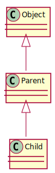

# 모든 자바의 부모인 java.lang.object class

모든 클래스의 부모 클래스가 존재하는데, 이 부모 클래스는 바로 `java.lang.Object` 이다.

```java
package sec11.inheritance

public class InheritanceObject {
    public static void main(String[] args) {
        InheritanceObject object = new InheritanceObject();
        System.out.println(object.toString());
    }
}
```

자바에서는 기본적으로 아무런 상속을 받지 않으면, `java.lang.Object` 클래스를 확장한다.
이로인해, `InheritanceObject` 에는 아무런 `method` 를 선언하지 않았지만, `toString` 메서드 사용이 가능하다

> 이는 "`javascript` 에서도, `Primitive Value` 를 제외한 모든것은 객체이다." 와 비슷한 맥락인듯 하다.
`javascript` 에서 모든 것이 객체이므로, `Object` 를 상속받는다.
참고로, `Primitive value` 는 `number, string, undefined, null, bigint, symbol, boolean` 이 있다.
사실, `symbol` 은 객체로 구분해야 하지 않나 싶은데, 특별한 값이니 `Primitive value` 로 넣은것 같다.

[java.lang.Object](https://docs.oracle.com/javase/8/docs/api/) 에서 보면 다음처럼 설명한다.

> "Class Object is the root of the class hierarchy."<br/>
> `Class Object` 는 `class` 계층 구조의 `root` 이다.<br/><br/>
Every class has Object as a superclass.<br/>
모든 `class` 는 `superclass` 로써 `Object` 를 가진다.<br/><br/>
All objects, including arrays, implement the methods of this class.<br/>
모든 `Objects` 는 이 `class` 의 구현된 메서드들, 배열들을 포함한다. 

그리고, `Object` 클래스에는 `toString` 메서드를 포함하고 있는것을 볼 수 있다. 
그러므로, 만약 `Child` 가 `Parent` 로부터 상속받았다면 이는 사실 `Object` 도 같이 상속되어졌다는 의미이다.


<div hidden>

```uml
@startuml object_inheritance.svg 
Object <|-- Parent
Parent <|-- Child
@enduml
```
</div>

이렇게 `Java` 는 `Object` 클래스를 기본 제공함으로써, 기본적인 행동을 정의하고, 처리할수 있도록 해준다.

## Object 클래스에서 제공하는 메서들들의 종류

`Object` 클래스에서 제공하는 메서드들은 [java.lang.Object](https://docs.oracle.com/javase/8/docs/api/) 에서 제공하는 `Object` 에서 확인가능하다.
책에서는 다음처럼 구현되어있다.

| 메서드 | 설명 |
| :--- | :-- |
| protected Object clone() | 객체의 복사본을 만들어 리턴 |
| public boolean equals(Object obj) | 현재 객체와 매개변수로 넘겨받은 객체가 같은지 확인, 같으면 true, 아니면 false 를 리턴 |
| protected void finalize() | 현재 객체가 더이상 쓸머 없을때 가비지 컬렉터에 의해서 이 메서드가 호출. |
| public class<?> getClass() | 현재 객체의 `Class` 클래스의 객체를 리턴. |
| public int hashCode() | 객체에 대한 해시코드(`hash code`) 값을 리턴. `16진수로 제공되는 객체의 메모리 주소` |
| public String toString() | 객체를 문자열로 표현하는 값을 리턴 |

다음은 `Object` 클래스에서 `thread` 를 처리하기 위한 메서들이다.

| 메서드 | 설명 |
| :--- | :-- |
| public void notify() | 이 객체의 모니터에 대기하고 있는 단일 쓰레드를 깨운다 |
| public void notifyAll() | 이 객체의 모니터에 대기하고 있는 모든 쓰레드를 깨운다 |
| public void wait() | 다른 쓰레드가 현재 객체에 대한 `notify()` 메서드나 `notifyAll()` 메서드를 호출할때까지 현재 `thread` 가 대기하도록 한다. |
| public void wait(long timeout) | `wait()` 메서드와 동일한 기능을 수행하며, 매개 변수에 지정한 시간만큼만 대기.<br/>밀리초(1/1000) 단위 |
| public void wait(long timeout, int nanos) | `wait()` 메서드와 동일한 기능을 수행하며, 밀리초 단위와 나노초 단위를 제공하여 더 세밀하게 대기시간을 설정 <br/> 밀리초(1/1000) + 나노초(1/1000000000)<br/>나노초의 값은 `0~999,999` 사이의 값만 지정가능|

## `Object.toString` 메서드

`toString` 메서드는 `Object` 클래스에서 가장 많이 사용되는 메서드중 하나이다.
어떠한 객체인지 쉽게 나타낼수 있는 메서드이기 때문이다.

이 메서드가 자동으로 호출되는 경우는 다음과 같다.

- `System.out.println` 메서드에 매개변수로 들어가는 경우
- 객체에 대하여 더하기 연산을 하는 경우

```java
package sec11.inheritance;

public class ToString {
    public static void main(String[] args) {
        ToString thisObj = new ToString();
        thisObj.toStringMethod(thisObj);
    }

    public void toStringMethod(Object obj) {
        System.out.println(obj.toString());
        System.out.println(obj);
        System.out.println("plus " + obj);
    }
}

```

```sh
$ javac sec11/inheritance/ToString.java; java sec11/inheritance/ToString         

sec11.inheritance.ToString@1dbd16a6 
sec11.inheritance.ToString@1dbd16a6
plus sec11.inheritance.ToString@1dbd16a6

```

첫번째 출력은 `System.out.println(obj.toString())` 이며, 
두번째 출력은 `System.out.println(obj)`, 
세번째 출력은 `System.out.println("plus" + obj)` 이다.

이렇게 `println` 함수를 사용하여 출력하면, 자동적으로 `obj.toString()` 메서드가 출력되는거을
확인할수 있다.

이를 더 깔끔히 만들기 위해서는, 자기자신을 참조하는 `this` 를 사용하면 손쉽게 사용가능하다.

> 물론, 이는 자기자신을 참조해서 출력할때 의미가 있다. 만약 다른 `class instance` 를 받아
출력한다면, 인자로 받는것이 맞다.

```java
    public foid toStringMethod() {
        System.out.println(this.toString());
        System.out.println(this);
        System.out.println("plus " + this);
    }
```

이렇게 하면, `this` 는 자기자신을 참조하므로, 출력은 같다.
책에서는 실제 `Object` 클래스에 구현되어있는 `toString()` 메서드는 다음과 같다고 한다.

```java
getClass().getName() + '@' + Interger.toHexString(hashCode());
```

여기에서, `getClass()` 는 `api` 상에 다음처럼 설명한다.

> Returns the runtime class of this Object.<br/>
> `Object` 의 런타임(현재 실행중인) `class` 를 반환한다.

이를 통해 현재 실행중인 `object` 의 `class` 를 반환하는것으로 볼수 있다.
반환된 `class` 에는 `java.lang.Class<T>` 로 구현되므로, `Class<T>` 의 메서드인
`getName` 을 사용할수 있다.

`getName` 은 구현된 `class` 의 이름을 반환한다.
그리고 `@` 와 `Integer.toHexString()` 에 인자값으로 `hashCode` 값을 주어
`int` 값을 `16진수` 값으로 변환하는 코드이다.

책에서는 `toString()` 메서드를 `overriding` 하는 방식을 통해 기본 구현된 메서드를
개발자가 직접 구현하여 대체할수 있음을 설명한다.

```java
package sec11.inheritance;

public class ToString {
    public static void main(String[] args) {
        ToString thisObj = new ToString();
        thisObj.toStringMethod(thisObj);
    }

    public String toString() {
        return "ToString Class";
    }

    public void toStringMethod(Object obj) {
        System.out.println(obj.toString()); // ToString Class
        System.out.println(obj); // ToString Class
        System.out.println("plus " + obj); // plus ToString Class
    }
}
```

이러한 방식을 사용하는데, 이러한 방식은 `DTO` 를 사용할때 유용하다고 한다.
`toString` 을 `overriding` 함으로써 `MemberDTO` 클래스의 인스턴스의 정보를 볼수있도록
처리한다고 말한다.

```java
package sec11.inheritance;

public class MemberDTO {
    public String name;
    public String phone;
    public String email;

    MemberDTO(String name, String phone, String email) {
      this.name = name;
      this.email = email;
      this.phone = phone;
    }

    public static void main(String[] args) {
      MemberDTO dto = new MemberDTO("Test", "010-1111-1111", "test@email.com");
      System.out.println(dto);
    }


    public String toString() {;
        return "Name=" + this.name + "Phone=" + this.phone + "Email=" + this.email;
    }
}
```

```sh
$ javac sec11/inheritance/MemberDTO.java; java sec11/inheritance/MemberDTO;
Name=TestPhone=010-1111-1111Email=test@email.com
```

이렇게, `System.out.println` 을 사용하여, `dto` 를 받아 처리할때,
`dto` 의 `toString` 을 `overrding` 하여 사용됨을 볼수 있다.

> 다시 말하지만 `System.out.println` 은 객체를 받을때, `toString` 을 자동적으로 호출한다.

## 객체는 `==` 만으로 같은지 확인할수 없으므로, `equals()` 를 사용

객체는 기본적으로 객체의 메모리주소를 비교한다.

```java
package sec11.inheritance;

public class Equals {
	public static void main(String args[]) {
		Equals thisObj = new Equals();
		thisObj.equalMethod();
	}
	
	public void equalMethod() {
    MemberDTO obj2 = new MemberDTO("Jh", "010-0000-0000", "jh@email.com");
		MemberDTO obj1 = new MemberDTO("Jh", "010-0000-0000", "jh@email.com");
		
		if (obj1 == obj2) {
			System.out.println("obj1 and obj2 is same.");
		} else {
			System.out.println("obj1 and obj2 is differance.");
		}
	}
}
```

```sh
$ javac sec11/inheritance/Equals.java; java sec11/inheritance/Equals;
obj1 and obj2 is differance.
```

이는 메모리주소값을 비교하므로, 생성된 `instance` 객체는 생성될때마다 다른 메모리주소값을 가진다.
그러므로, 다르다.

이는 기본적으로 제공하는 `equals` 메서드도 동일하게 동작하는데,
`equals` 메서드는 `hashCode()` 를 비교하기 때문이다.
> `hashCode` 는 `Object` 클래스의 메서드로, `Object` 의 메모리주소값을 `int` 형으로 반환한다.


그러므로, `equals` 를 통해 해당 `instance` 객체가 동일한지 비교하려면,
`equals` 를 `overriding` 할수 있다.

```java
package sec11.inheritance;

public class MemberDTO {
    public String name;
    public String phone;
    public String email;

    MemberDTO(String name, String phone, String email) {
      this.name = name;
      this.email = email;
      this.phone = phone;
    }

    public static void main(String[] args) {
      MemberDTO dto = new MemberDTO("Test", "010-1111-1111", "test@email.com");
      System.out.println(dto);
    }


    public String toString() {;
        return "Name=" + this.name + "Phone=" + this.phone + "Email=" + this.email;
    }

    public boolean equals(Object obj) {
      if (this == obj) return true;
      if (obj == null) return true;
      if (this.getClass() != obj.getClass()) return false;
      
      MemberDTO other = (MemberDTO) obj;

      if (name == null) {
        if (other.name != null) return false;
      } else if (!name.equals(other.name)) {
        return false;

      }
      if (email == null) {
        if (other.email != null) return false;
        else if (!email.equals(other.email)) {
          return false;
        }
      }

      if (phone == null) {
        if (other.phone != null) return false;
        else if (!phone.equals(other.phone)) {
          return false;
        }
      }

      return true;
  }
}
```

```java
package sec11.inheritance;

public class Equals {
	public static void main(String args[]) {
		Equals thisObj = new Equals();
		thisObj.equalMethod();
	}
	
	public void equalMethod() {
		MemberDTO obj1 = new MemberDTO("Jh", "010-0000-0000", "jh@email.com");
    MemberDTO obj2 = new MemberDTO("Jh", "010-0000-0000", "jh@email.com");
		
		if (obj1.equals(obj2)) {
			System.out.println("obj1 and obj2 is same.");
		} else {
			System.out.println("obj1 and obj2 is differance.");
		}
	}

}
```

```sh
$ javac sec11/inheritance/Equals.java; java sec11/inheritance/Equals;
obj1 and obj2 is same.

```

이번에는 `obj1 and obj2 is same` 을 출력하는것을 볼수 있다.


> 여기서 애매한것은 `String` 값의 비교이다.<br/>
`String` 값 같은경우, `String` 도 `class` 로 생성된다고 생각했다.<br/>
이는 객체이므로, 메모리값으로 비교할것이라고 보았지만, 특수한 객체라서
다르게 작동한다.

```java
String str1 = "hello";
String str2 = "hello";

System.out.println(str1 == str2); // true
```

> 이는, `true` 로 처리되는데, 내부적으로 `String Pool` 에 저장되어<br/>
불변 객체로써 작동한다고 말한다.<br/><br/>
하지만 `new` 키워드를 사용하여 `String` 을 만들면, 다르게 동작한다.

```java
String str1 = "hello";
String str2 = "hello";
String str3 = new String("hello");
String str4 = new String("hello");

// false, 다른 메모리 주소를 참조
System.out.println(str3 == str4);

// true, 문자열의 값을 비교
System.out.println(str3.equals(str4));
```

> 이를 통해, `new` 키워드를 사용하면 일반 객체처럼 작동하는것을 볼수 있다.<br/>
이러한 차이가 있을수 있으므로, 기본적으로 `equals` 를 사용하길 추천한다.

이러한 차이로, `String` 만 `equals` 로 비교한다.

## 객체의 고유값을 나타내는 `hashcode`

`hashcode` 메서드는 객체의 메모리주소를 리턴한다. 단, `int` 값으로 반환한다.
이는 이정도만 알고 넘어가도 될듯하다.


